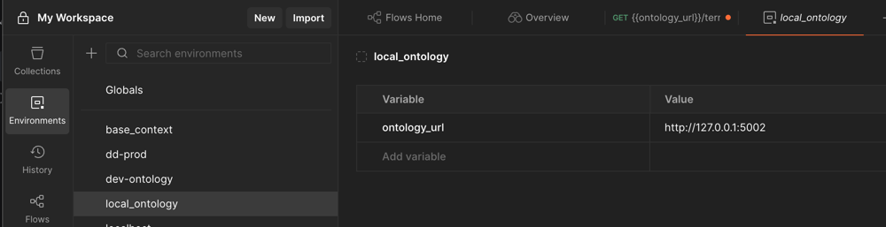

# Unified Biomedical Knowledge Graph

## ubkg-api

[](https://badge.fury.io/py/ubkg-api)

The components of the [Unified Biomedical Knowledge Graph (UBKG)](https://ubkg.docs.xconsortia.org/) include:
- The **source framework** that extracts ontology information from the UMLS to create a set of CSV files (**UMLS CSVs**)
- The **generation framework** that appends to the UMLS CSVs assertion data from other ontologies to create a set of **ontology CSVs**.
- A neo4j **ontology knowledge graph** populated from the ontology CSVS.
- An **API server** that provides RESTful endpoints to query the ontology knowledge graph.

This repository contains the source for the API.

The **ubkg-api** is a Flask web application with Blueprint extensions that provides a REST API for 
parameterized queries against an instance of a UBKG neo4j instance. 

The ubkg-api contains code that is common to all UBKG [contexts](https://ubkg.docs.xconsortia.org/contexts/), including code to handle connecting
to a UBKG instance. 

Other API implementations, such as the [hs-ontology-api](https://github.com/x-atlas-consortia/hs-ontology-api),
extend the ubkg-api. Endpoints common to all UBKG contexts are deployed in the ubkg-api; 
other API implementations can both "pass through" calls to ubkg-api endpoints or execute endpoints specific to the implementation.

An API implementation extends the ubkg-api by calling a version of the ubkg-api that has been 
published as a PyPI.

# SmartAPI documentation

The specification for the UBKG API can be found [here](https://smart-api.info/ui/96e5b5c0b0efeef5b93ea98ac2794837/).

# Developer Information

##  Development/testing environment for ubkg-api
To enhance or fix the ubkg-api, you will need to
establish an application development environment on the development machine. 
Components of the application development environment include:
1. An instance of a UBKG context--i.e., an instance of neo4j populated with UBKG content. Options include:
   - a local bare-metal instance of neo4j
   - a local Docker install of a UBKG distribution built from [ubkg-neo4j](https://github.com/x-atlas-consortia/ubkg-neo4j) 
   - a cloud-based instance (development or production)
2. A local branch of ubkg-api
4. URLs that execute endpoints against the local instance of ubkg-api

## Connecting to a UBKG instance
To connect the local branch of ubkg-api to a neo4j instance that hosts a UBKG context:
1. Copy the file named **app.cfg.example** in the src/ubkg-api/instance directory to a file named **app.cfg**. 
2. Add to app.cfg the connection information for the neo4j instance.
The .gitignore file at the root of this repo will force git to exclude the app.cfg file from commits.

### Example UBKG neo4j connect string values for app.cfg
If you are working with a local Docker distribution based on from [ubkg-neo4j](https://github.com/x-atlas-consortia/ubkg-neo4j), then
   - SERVER='bolt://localhost:u', where u is the browser port associated with _ui_port_ in the **container.cfg** file used by the build scripts.
   - USERNAME=neo4j
   - PASSWORD= the value of _neo4j_password_ from the common **container.cfg** file.

## Using API keys
Some deployments based on the UBKG API may require that calls to endpoints include an API key in the header.
Because this involves integration with authorization architecture (e.g., API gateways and authorization specific to a 
network resource), the configuration of API keys is beyond the scope of the UBKG API. 

The [Data Distillery API](https://smart-api.info/ui/1ab18b7ba0b2539a361c8df3686f47f0) is an example of an API that queries
a UBKG instance, but requires an API key.


### Starting your neo4j instance
If you are using a local instance of the UBKG, the instance should be running. 
In particular, if you installed a local Docker instance of UBKG, be sure that Docker Desktop is running. 
If the neo4j instance is not available, calls to API endpoints will result in a 500 error.

## Connecting to the local instance of ubkg-api
For URLs that execute endpoints in your local instance, use the values indicated in the **main.py** script, in the section prefaced with the comment `For local development/testing`:

For example, if main.py indicates
``
app.run(host='0.0.0.0', port="5002")
``

then your test endpoint URLs should start with `http://127.0.0.1:5002/`.

For example, if you test using PostMan, you can set a global variable corresponding to the first part of your test URLs:



# Testing changes
To test changes to ubkg-api, you will need to start a local instance of the API.
The following assumes that you have created a local branch of ubkg-api.

### From the command line
1. Move to the root of your local branch.
2. Create a Python virtual environment. The following command creates a virtual environment named _venv_.

   ``python -m venv venv``
3. Activate the virtual environment.
   
   ``source venv/bin/activate``
4. Move to the /src directory and install dependencies, inclduing the ubkg-api package.
   
   ``pip install -r requirements.txt``

5. Run app.py to start the local instance of the API.
   
   ``python app.py``


### In PyCharm
1. Create a new project based on a local clone of ubkg-api. PyCharm should establish a virtual environment. (Refer to instructions [here](https://www.jetbrains.com/help/pycharm/creating-virtual-environment.html#python_create_virtual_env).)
2. Use the Python Packages tab to install the packages listed in **requirements.txt**.
3. In the Terminal window, run app.py.
4. Note that you may need to enable execute permissions on the app.py script before you can run it locally--e.g., with a command like ``chmod 777 app.py``

### URL testing

Once you have connected your instance of hs-ontology-api to instances of both neo4j and ubkg-api, run the following tests:
1. Paste the root endpoint URL into a browser window--e.g.,``http://127.0.0.1:5002/``. You should see a window with the status message `Hello! This is UBKG-API service :)`. The status message verifies that your local instance of hs-ontology-api is connected to an instance of ubkg-api.
2. Add to the root endpoint URL to execute a known endpoint--e.g., ``http://127.0.0.1:5002/concepts/C0678222/codes``. You should see a response from the ubkg-api, depending on the endpoint.
3. If you are only testing endpoints in an extension api (e.g., hs-ontology-api) and are using the PyPi install of ubkg-api, calls to endpoints managed by the ubkg-api will fail with a 500 error. To test endpoints from both hs-ontology-api and ubkg-api, you will need a local instance of ubkg-api that connects to the same instance of neo4j to which the instance of hs-ontology-api connects.

Various methods of testing endpoint URLs are possible, including:
1. **curl**, from either the command line or a shell script
2. Requests in Postman
3. A Python script using **Requests** or **pytest**
4. Executing directly in the browser. This method is suitable for GET endpoints.

# Adding new endpoints

## Development note
The ubkg-api currently uses two architectures:
1. "legacy" endpoints use a MVC (Model-View-Controller) architecture in which the "native" results from Cypher queries are translated by means of a class hierarchy. 
2. Newer endpoints use a simpler architecture, in which Cypher queries of streamed JSON are essentially passed through to response with little additional processing.

The following instructions are primarily for the legacy architecture.

Each endpoint in ubkg-api involves:
- One or more functions in the **_functional script_** (**neo4j_logic.py**). The usual use case is a parameterized function that prepares a Cypher query against the target neo4j instance.
- a **_controller_** script in the __routes__ path that registers a BluePrint route in Flask and links a route to a function in the functional script.
- a **model** script in the __models__ path that describes the class that corresponds to the response of the endpoint.

## Tasks:
### Create a model script
The model script is a class that defines the response for the endpoint.
#### NOTE: This is the legacy architecture.
#### File path
Create the script in the __models__ path.
#### Class method
1. `__init__`: For every key that is returned,
   1. List as a parameter.
   2. Declare the type in the `self.openapi_types` dictionary.
   3. Declare the mapping in the `self.attribute_map` dictionary.
   4. Declare an internal property of the class to match the key.

For example, for a string value with key _approved_symbol_,
```
       self.openapi_types = {
            'approved_symbol': str
        }
        self.attribute_map = {
            'approved_symbol': 'approved_symbol',
        }
        self._approved_symbol = approved_symbol
```

2. Add `serialize` and `from_dict` methods that refer to the returned key/value pairs. Override the return type of the `from_dict` to point to the model class.

The following code is from the **GeneDetail** model class in __genedetail__.
```
    def serialize(self):
        return {
            "approved_symbol": self._approved_symbol
        }

    @classmethod
    def from_dict(cls, dikt) -> 'GeneDetail':
        """Returns the dict as a model

        :param dikt: A dict.
        :type: dict
        :return: The GeneDetail of this GeneDetail
        :rtype: GeneDetail
        """
        return util.deserialize_model(dikt, cls)
```

3. For each key in the response, define getter and setter functions.
```
   @property
   def approved_symbol(self):
        return self.approved_symbol

    @approved_symbol.setter
    def approved_symbol(self, approved_symbol):
        self._approved_symbol = approved_symbol

```

### Add functional script code to neo4j_logic.py
The _neo4j_logic.py_ script contains endpoint-related functions. The usual use case is a parameterized Cypher query.

#### Naming convention
1. For functions called directly from controllers, name the function with format *model*_*method*_logic. For example, the function that satisfies the POST method for the *genedetail* controller would be called **genedetail_post_logic**.
2. Subfunctions called by main functions should be prefixed with an underscore.

#### Loading large Cypher queries
If the Cypher query used by an endpoint function is complex, store an annotated copy of the query in the _cypher_ directory.

#### Examples
The methods for returning to GET requests and POST requests are slightly different. You should be able to find examples of either type of function.

#### Loading Cypher query strings

Large or complex Cypher query strings can be stored in files in the _cypher_ directory and loaded using the **loadquerystring** function in the **common_neo4j_logic.py** script.

Following is the excerpt from **common_neo4j_logic.py** that loads the large Cypher query string used for the _genes_ endpoint.
```

    # Load Cypher query from file.
    query: str = loadquerystring('codes_code_id_codes.cypher')
    
```
#### Nested objects

If your response body is to contain nested objects, you will need to create models for each type of sub-object. 
The containing model script will need to import the sub-object models. 

For an example, review **genedetail.py** in hs-ontology-api.

### Build a controller script
#### File path
Create a Python package in the __routes__ path.

#### Define Blueprint
Define a Blueprint object and route for your endpoint. Follow examples in the existing controllers.

### Register your Blueprint
In *app.py*, 
1. Import your Blueprint.
2. Register your Blueprint with Flask.

The following snippet registers the Blueprint:

```
from common_routes.codes.codes_controller import codes_blueprint
self.app.register_blueprint(codes_blueprint)
```

# Updating SmartAPI documentation
To add the specification for a new endpoint to the SmartAPI documentation for hs-ontology-api, update the file **ubkg-api-spec.yaml**.

ubkg-api-spec.yaml conforms to [Swagger OpenAPI](https://swagger.io/specification/) format.

You will need to specify:
1. Paths that correspond to your endpoint routes.
2. Schemas that correspond to the responses from endpoints.


# Building and publishing to PyPI

To build and publish the ubkg-api as a PyPI package,

```
python -m build
python3 -m twine upload dist/*
```

## Requirements
Python 3.9 or newer

# Optional Timeout Feature

The ubkg-api can be deployed in various environments.

When deployed behind a server gateway, such as AWS API Gateway, the gateway may impose constraints
on timeout or response payload size. For example, AWS API Gateway has a timeout of 29 seconds and
a maximum response payload of 10 MB. 

The ubkg-api can be configured to enforce its own timeout that
occurs before an actual gateway timeout, essentially acting as a proxy for 
the gateway. 
The ubkg-api's HTTP 504 timeout message will return detailed 
explanations for the timeout.
## Code required
### app.cfg
To enable custom management of timeout and payload size, specify values in the **app.cfg** file, as shown below.

```commandline

# Maximum duration for the execution of timeboxed queries to prevent service timeout, in seconds
# The AWS API gateway timeout is 29 seconds.
TIMEOUT=28
```
If the ubkg-api is imported as a PyPI package into a child API (the default configuration), the
timeout should be specified in the app.cfg of the child API. The configuration of the child API
takes precedence over that of the ubkg-api.

### Endpoint function code
To validate timeout, use a try/exception block in the 
code in the **neo4j_logic.py** in the *utils* folder.
 
Example:
```commandline
from werkzeug.exceptions import GatewayTimeout
...
    #Set timeout for query based on value in app.cfg.
    query = neo4j.Query(text=querytxt, timeout=neo4j_instance.timeout)

    with neo4j_instance.driver.session() as session:
        try:
            recds: neo4j.Result = session.run(query)

            for record in recds:
                # process records

        except neo4j.exceptions.ClientError as e:
            # If the error is from a timeout, raise a HTTP 408.
            if e.code == 'Neo.ClientError.Transaction.TransactionTimedOutClientConfiguration':
                raise GatewayTimeout

    return <your records>
```

The ubkg-api returns a custom HTTP 504 response when a query
exceeds the configured timeout.

## Coding required
### app.cfg
To enable timeout validation, specify the following key in the app.cfg file:
```commandline
LARGE_RESPONSE_THRESHOLD = 9*(2**20) + 900*(2**10) #9.9Mb
```
# Payload size validation with optional S3 redirection

APIs in environments employing an AWS API gateway have limits on
the size of response payloads. The current default AWS API gateway limit on payloads is 10 MB.

The ubkg-api can be configured to check the size of response payloads. This feature can
be used to prevent triggering of the actual gateway error. In addition,
the ubkg-api's HTTP 403 error code message provides more detail than does the message from the gateway.

The ubkg-api can also work around a gateway payload limit by redirect large payloads to an AWS S3 bucket. 
The ubkg-api will return a URL that points to the file in 
the S3 bucket. The URL is "pre-signed": consumers can simply
"get" the URL to download the file locally.

If S3 redirection is not configured, the ubkg-api will return a simple HTTP 403 response. 

## Coding required
### app.cfg
To enable S3 redirection, specify values in the **app.cfg** file.
```commandline
# Large response threshold, as determined by the length of the response (payload).
# Responses with payload sizes that exceed the threshold will be handled in one of the
# following ways:
# 1. If the threshold is 0, then the response will be passed without any additional processing.
# 2. If the threshold is nonzero and S3 redirection is not enabled, the API will return
#    a custom HTTP 403 response.
# 3. If the threshold is nonzero and S3 redirection is enabled, the API will stash the
#    response in a file in an S3 bucket and return a pre-signed URL pointing to the
#    stashed file.
# Setting the threshold to 9.9MB avoids triggering a HTTP 500 from an AWS API Gateway's hard
# 10 MB payload limit
LARGE_RESPONSE_THRESHOLD = 9*(2**20) + 900*(2**10) #9.9Mb

# OPTIONAL AWS credentials for S3 redirection. If there are no "AWS_*" keys, the
# API will return the default HTTP 403 exception.
# https://boto3.amazonaws.com/v1/documentation/api/latest/guide/credentials.html
AWS_ACCESS_KEY_ID = 'AWS_ACCESS_KEY_ID'
AWS_SECRET_ACCESS_KEY = 'AWS_SECRET_ACCESS_KEY'
AWS_S3_BUCKET_NAME = 'AWS_S3_BUCKET_NAME'
AWS_S3_OBJECT_PREFIX = 'AWS_S3_OBJECT_PREFIX'
AWS_OBJECT_URL_EXPIRATION_IN_SECS = 60*60 # 1 hour
```
Note that if the ubkg-api is being imported as a PyPI package (the default configuration),
the S3 configuration should be specified in the app.cfg of the child api.
Configuration in the child API takes precedence over that of the ubkg-api.

### route logic
Add the following import to the controller:
```commandline
# S3 redirect functions
from utils.s3_redirect import redirect_if_large
```

Send the result of the query to payload validation:
```commandline
    result = <call to function in neo4j_logic.py>
    # Redirect to S3 if payload is large.
    return redirect_if_large(resp=result)
```