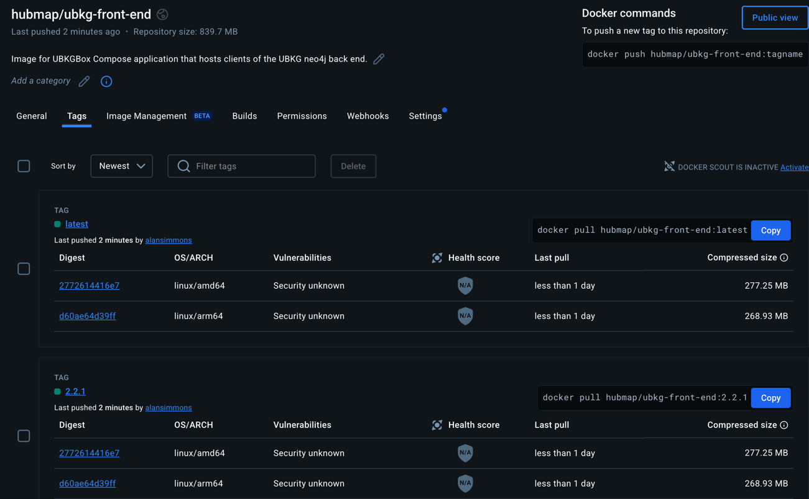

# Unified Biomedical Knowledge Graph

## Integrating ubkg-api into a UBKGBox deployment (ubkg-front-end)

**[UBKGBox](https://github.com/x-atlas-consortia/ubkg-box)** is a Docker Compose
multi-container application featuring:
- a **ubkg-back-end** service running an instance of a UBKG context in neo4j
- a **ubkg-front-end** service running a number of UBKG clients, including an instance of ubkg-api.

The code in the _/docker_ directory of this repository can be used to build and push
the **ubkg-front-end** image of **UBKGBox**.

# Supported platforms
The bash shell scripts contained in this directory are intended for use on Mac OS X or Linux. 
These scripts will not work on Windows. 
(The resulting Docker images should, however, run on Windows.)

# Divergence from standard hubmapconsortium API Compose framework
The **ubkg-front-end** Docker Compose architecture is based on the framework of Shell scripts and Compose YML files used to containerize APIs 
deployed by the HuBMAP Consortium, with significant differences.
1. Unlike other APIs in the consortium, the ubkg-api is deployed both as an application in **UBKGBox** and as a PyPI package to be used by other "child APIs". For this reason, the _/src_ directory of the ubkg-api repo has an additional level of subdirectory, corresponding to both the actual API source and the PyPA Egg information.
2. Unlike other APIs in the consortium, the **ubkg-front-end** image must be available for both linux/amd64 and linux/arm64 architectures.

# Build Workflow Prerequisites
## Docker
[Docker must be installed](https://docs.docker.com/engine/install/) on the development machine with Docker BuildX build support.  
By default Docker BuildX support is installed with Docker Desktop.  If you have a version of Docker installed without Desktop you can [install Docker BuildX manually](https://docs.docker.com/build/install-buildx/).

## Docker Desktop resources
Building the **ubkg-front-end** image and container will require more than the default amount of resources.
Manage Docker resources in Docker Desktop from the _Settings>Resources>Advanced_ menu.
### OOME
Docker Out of Memory Errors (OOME) manifest as exits with [error code 137](https://medium.com/javarevisited/understanding-and-resolving-docker-exit-code-73ff617230cf). 

To address OOMEs, increase the **Memory Limit** to at least 16 MB.

### yum file system
The Dockerfile installs packages and dependencies using the **yum** package manager. 
The size of packages such as nginx may exceed the available space allocated to the container file system, resulting
in a failure to solve in yum with messages like `At least 4MB more space needed on the filesystem.`

To address yum file system size, increase the **Disk usage limit** to a value larger than the default (8 MB).

## Docker Hub
To publish **ubkg-front-end** images in the Docker Hub registry, the developer must be logged in to Docker Hub with an account that has privileges in the [hubmap consortium](https://hub.docker.com/orgs/hubmap/teams/consortium/members) organization.

## Docker Compose for multiple architectures
The Docker Compose workflow will push **ubkg-front-end** images to Docker Hub for both 
linux/amd64 (Intel) and linux/arm64(OSX) architectures. This requires that:
- the development machine runs two buildx builders.
- the **docker-compose.development.yml** file includes keys that enable multiple architectures (**tags** and **x-bake**)

Refer to [this article](architecture-builds-are-possible-with-docker-compose-kind-of-2a4e8d166c56) for an explanation of configuring Docker Compose for multiple architectures.

To prepare the development machine to build images in multiple architectures, run the following command:

`docker buildx create --use`

To see the list of builders on the machine, run

`docker buildx ls`

Once at least two buildx builders are available, the build workflow will build and push images in both architectures.

# Build Workflow (OSX machine)
1. Start Docker Desktop.
2. Log in to Docker Hub with a user that has access to the **hubmap** organization.
3. `./docker-development.sh build` will build the following in Docker:
   - an image named **hubmap/ubkg-front-end** and tag equal to the string in the VERSION file in the root folder of the ubkg-api repo
   - an image named **hubmap/ubkg-front-end** and tag of **latest**
   - an image named **moby/buildkit** and tag **buildx-stable-1**.
   - a container named **buildx_buildkit_**_builder_, where _builder_ is the name of the additional buildx builder created as a prerequisite. 
   The last image and container correspond to the image with linux/arm64 architecture.
4. `./docker-development.sh push` will push tagged images for both linux/amd64 and linux/arm64 architectures to the Docker hub repo named **hubmap/ubkg-front-end**:
