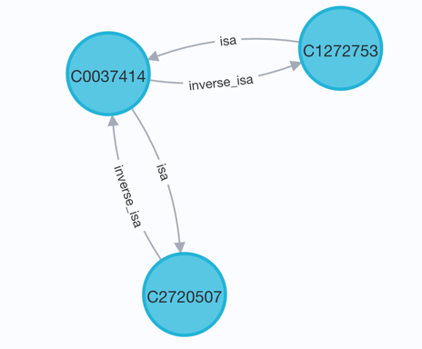

# Unified Biomedical Knowledge Graph
## UBKG API Release Notes

## Version 2.1.0 (March 2024)

### Configurable execution throttling: timeouts
Some endpoints in the UBKG API feature parameters that can result in long queries. 
This is especially the case for endpoints in _/concepts/paths_. 
The service host for the UBKG API may have constraints on timeout or maximum payload size. 

v 2.0 of the UBKG API limited query length by means of the  _apoc.runTimeboxed_ function. 
Timeboxing fails with queries that return collected path variables, such as are returned by the queries behind the _/concepts/paths_ endpoints.

v 2.1 replaces wrapping queries with the _apoc.runTimeboxed_ function by wrapping query strings
in a **neo4j.Query** object.

### Changes to endpoints

#### Paths related endpoints
The following endpoints related to paths have been refactored:
- _concepts/expand_ 
- _concepts/trees_
- _concepts/shorestpaths_
- _concepts/subgraphs_

In v 2.1 of the UBKG API, these endpoints return JSON objects that include information on the following elements in the response:
- nodes
- edges (relationships)
- paths

The schema of the response replicates that of the neo4j Browser's Table result frame.

For example, consider the shortest path between the concept with CUIs C2720507 and C1272753 for SAB=SNOMEDCT_US and
rel=isa. The _shortestpath_ endpoint executes a query that returns a graph with the following 
visualization in the neo4j browser:



The endpoint's response is identical to the contents of the Table result frame for this query in neo4j browser:
```
{
    "edges": [
        {
            "SAB": "SNOMEDCT_US",
            "source": "C0037414",
            "target": "C2720507",
            "type": "isa"
        },
        {
            "SAB": "SNOMEDCT_US",
            "source": "C1272753",
            "target": "C0037414",
            "type": "isa"
        }
    ],
    "nodes": [
        {
            "id": "C2720507",
            "name": "SNOMED CT Concept (SNOMED RT+CTV3)"
        },
        {
            "id": "C0037414",
            "name": "Social Environment"
        },
        {
            "id": "C1272753",
            "name": "Institution (social concept)"
        }
    ],
    "paths": [
        {
            "end": {
                "elementId": "419902",
                "identity": 419902,
                "labels": [
                    "Concept"
                ],
                "properties": [
                    {
                        "CUI": "C1272753"
                    }
                ]
            },
            "length": 2.0,
            "segments": [
                {
                    "end": {
                        "elementId": "57732",
                        "identity": 57732,
                        "labels": [
                            "Concept"
                        ],
                        "properties": [
                            {
                                "CUI": "C2720507"
                            }
                        ]
                    },
                    "relationship": {
                        "elementId": "6561533",
                        "end": 57732,
                        "endNodeElementId": "57732",
                        "identity": 6561533,
                        "properties": [
                            {
                                "SAB": "SNOMEDCT_US"
                            }
                        ],
                        "start": 2938145,
                        "startNodeElementId": "2938145",
                        "type": "isa"
                    },
                    "start": {
                        "elementId": "2938145",
                        "identity": 2938145,
                        "labels": [
                            "Concept"
                        ],
                        "properties": [
                            {
                                "CUI": "C0037414"
                            }
                        ]
                    }
                },
                {
                    "end": {
                        "elementId": "2938145",
                        "identity": 2938145,
                        "labels": [
                            "Concept"
                        ],
                        "properties": [
                            {
                                "CUI": "C0037414"
                            }
                        ]
                    },
                    "relationship": {
                        "elementId": "6948568",
                        "end": 2938145,
                        "endNodeElementId": "2938145",
                        "identity": 6948568,
                        "properties": [
                            {
                                "SAB": "SNOMEDCT_US"
                            }
                        ],
                        "start": 419902,
                        "startNodeElementId": "419902",
                        "type": "isa"
                    },
                    "start": {
                        "elementId": "419902",
                        "identity": 419902,
                        "labels": [
                            "Concept"
                        ],
                        "properties": [
                            {
                                "CUI": "C1272753"
                            }
                        ]
                    }
                }
            ],
            "start": {
                "elementId": "57732",
                "identity": 57732,
                "labels": [
                    "Concept"
                ],
                "properties": [
                    {
                        "CUI": "C2720507"
                    }
                ]
            }
        }
    ]
}
```